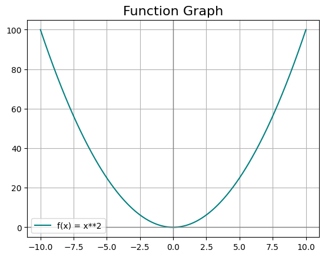

# 📈 Graphing Calculator

A modern, interactive web app to plot mathematical functions and visualize their derivatives, built with [Streamlit](https://streamlit.io/), [SymPy](https://www.sympy.org/), and [Matplotlib](https://matplotlib.org/).



---

## ✨ Features

- **Plot any mathematical function**: Enter expressions like `x**2`, `sin(x)`, `exp(x)`, etc.
- **Visualize derivatives**: Instantly see the symbolic derivative of your function.
- **Beautiful UI**: Custom JetBrains Mono font and a clean, modern look.
- **PDF Export**: (see [`src/exporter.py`](src/exporter.py)) Export your function, its derivative, and the graph to a PDF (feature in code, UI integration optional).

---

## 🚀 Getting Started

### 1. Clone the Repository

```sh
git clone https://github.com/ali-husnain09/GraphingCalculator.git
```
```sh
cd GraphingCalculator

```
### 2. Install Dependencies
```sh
uv add sympy matplotlib streamlit 

```
### 3. Run the App

```sh
streamlit run main.py
```

## 📁 Project Folder Structure

```
.
├── main.py                # Streamlit app entry point      
├── src/
│   ├── analyzer.py        # Symbolic math utilities (derivative, latex,
│   ├── plotter.py         # Matplotlib plotting logic
│   └── exporter.py        # PDF export functionality
├── assets/
│   ├── custom.css         # Custom styles
│   └── graph.png          # Example graph image
├── .streamlit/
│   └── config.toml        # Streamlit theme config
├── pyproject.toml         # Project metadata & dependencies
└── README.md              # This file
```
